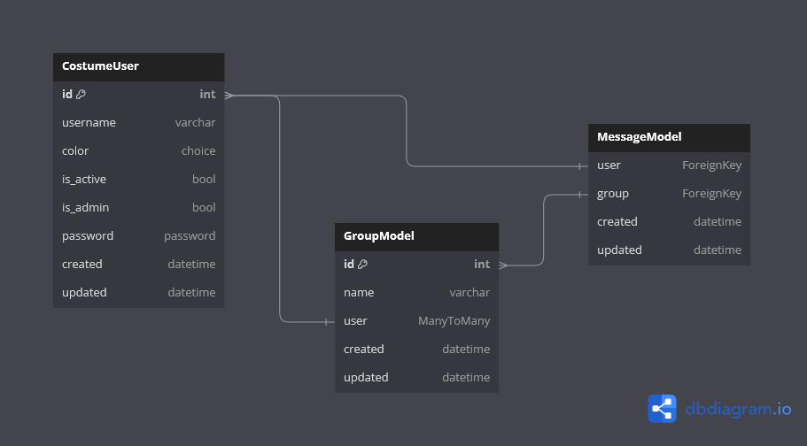

<h1>DJANGO + HTMX + WEBSOCKET</h1>
<h5>this is the messager app with online chat in groups [ first project ]</h5>

# DJANGO

<p>django-project without any asynchronous task. here some detail about apps</p>
<ul>
    <li>app - account
        <ul>
            <li>CostumeUser:
                <p>- registration with name and password</p>
                <p>- name is defined as username ( evaluated to be unique )</p>
                <p>- signup and login is in one page ( view ) so there is no confirm-password</p>
                <p>- each user have random color in chat (saved in db)</p>
            </li>
        </ul>
    </li>
    <br>
    <li>app - message
        <ul>
            <li>Group:
                <p>- each group contain their users with ManyToManyField</p>
                <p>- after registration user will send to group page</p>
                <p>- in group page user will see the groups that admin make permission for user</p>
            </li>
            <li>Message
                <p>- after user select it group, user will send to message-page</p>
                <p>- in message-page there is all previous messages that each user have their own color</p>
                <p>- message-page will restrict user that have no permission for group or unauthenticated</p>
                <p>- each message is unique by group and user</p>
            </li>
        </ul>
    </li>
</ul>


# HTMX
<h5>road:</h5>
<ul>
    <li>message.html -----request----> hx-post ---> MessageView / post -----context----> chat-message.html ---> DONE_1</li>
    <li>- - - > hx-target ---> [ find tag ] ---> DONE_2</li>
    <li>- - - > hx-swap ---> [ add {DONE_1} to {DONE_2} ] ---> FINISHED</li>
</ul>
<h5>files-directory:</h5>

``` files-directory
    message
       |------ views.py
       |------ templates
                   |------ message.html
                   |------ snippet
                             |------ chat-message.html
```
<br>
<h5>message.html</h5>

```html

    <p id="htmx-chat"
       class="text-{{ chat.user.color }}-500 my-1">{{ chat.user.username }}] {{ chat.message }}</p>


<form method="post" hx-post="" hx-target="#htmx-chat" hx-swap="beforebegin">
    <input name="message">
    <button type="submit">submit</button>
</form>
```
<h5>chat-message.html</h5>

```html
<p id="htmx-chat">{{ chat.user.username }}] {{ chat.message }}</p>
```
<h5>views.py</h5>

```python
from django.shortcuts import render
from django.views import View
from .models import MessageModel, GroupModel
from .forms import MessageForm
from django.shortcuts import get_object_or_404
class MessageView(View):
    form_class = MessageForm
    
    # def dispatch ...
    
    # def get...
    
    def post(self, request, group_name):
        form = self.form_class(request.POST)
        if form.is_valid():
            chat = MessageModel.objects.create(user=request.user, group=get_object_or_404(GroupModel, name=group_name), message=form.cleaned_data['message'])
            return render(request, 'message/snippet/chat-message.html', {'chat': chat})
```